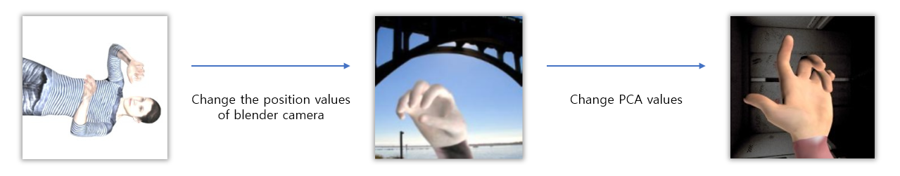
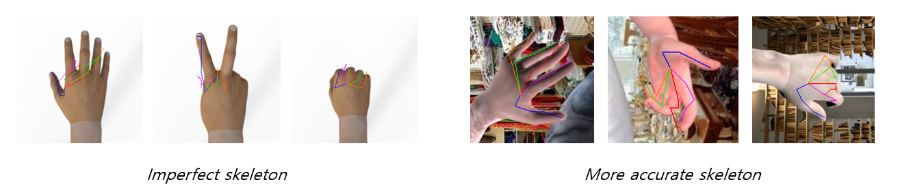
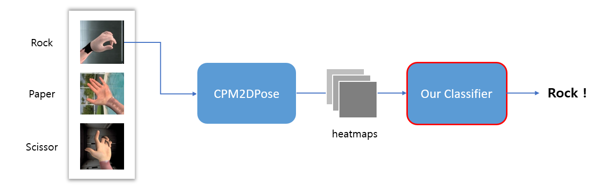

## Computer Vision Final Project

>- UNIST CSE480 Computer Vision, Team 6
>- Team members: 정유호, 김소랑, 정지운

### Problem definition

1. **Improve the accuracy of the hand pose estimation network** you implemented in the Assignment 2 using data augmentation, data generation methods or changing the network architecture etc.
2. Develop a new function for the hand pose estimation network that can **classify rock-paper-scissors’ poses** according to their estimated poses. It may require collecting some new data and their annotations for the classification labels.

### A simple overview

- `pretrained_weight.pth`: Initial weight of our project
- `finetunedweight.pth`: Weight after tuning the hyperparameters of model
- `rpsweight.pth`: Weight of the classifier for rock-paper-scissors

#### Synthetic data generation

How to create a rock-paper-scissors image through a blender

The results of skeleton(joints) plotting

#### Classifier model

### Role and responsibilities

| Team member name |                   Role and responsibility                    | Contribution score |
| :--------------: | :----------------------------------------------------------: | :----------------: |
|      정유호      |   Implementation of the classifier for rock-paper-scissors   |        33%         |
|      김소랑      | Data collection & generation Idea proposal for improve accuracy |        33%         |
|      정지운      | Architecture changing (Hyperparameter tuning) Idea proposal for improve accuracy |        33%         |

### Reference

- [(CSE48001_Final Project) Data Augmentation Tutorial_kor](https://www.notion.so/CSE48001_Final-Project-Data-Augmentation-Tutorial_kor-c07a3b43a122429db5b2d3553213a65c)
- [hassony2. "manopth" repository. *github*.](https://github.com/hassony2/manopth)
- [lmoroney@. "Rock Paper Scissors Dataset."](http://www.laurencemoroney.com/rock-paper-scissors-dataset/)